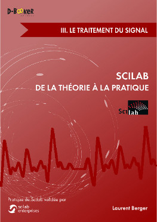

#Scilab : De la théorie à la pratique
#III. Le traitement du signal

Ce dépôt contient les codes sources du module Anaspec présenté au chapitre 4 du livre [Scilab : De la théorie à la pratique - III. Le traitement du signal](http://d-booker.jo.my/sci-signal) écrit par Laurent Berger, à paraître le 26 juin 2014 aux [éditions D-BookeR] (http://www.d-booker.fr).

Ce module active deux applications : un analyseur et un égaliseur de spectre audio.

